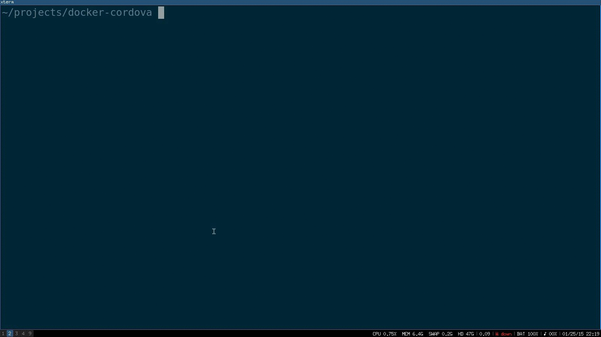

# Docker container for Cordova development

## Content

* [why](#why)
* [Setup](#setup)
* [New Project](#new-project)
* [Miscellaneous](#miscellaneous)
* [References](#references)

## Why?

I don't want to install and configure Java, Android SDK, Ant, cordova etc.. life is too short. 

## Setup

    git clone git@github.com:oren/docker-cordova.git
    cd docker-cordova
    docker build -t cordova .
    echo "alias cordova='docker run --rm -i -v \$(pwd):/workspace -w /workspace --privileged -v /dev/bus/usb:/dev/bus/usb cordova cordova'" >> ~/.bash_aliases
    source ~/.bash_aliases

The alias command lets you use `cordova` for running any command inside the cordova container.

## New Project

    cordova create hello com.example.hello HelloWorld
    cd hello
    cordova platform add android
    cordova build
    
Connect your android device to your laptop with a usb

    cordova run android
 
That's it, your app should be on your phone!

## Miscellaneous

I keep all my dockerfiles in a folder:

    dockerfiles/
    ├── cordova
    │   ├── Dockerfile
    │   └── readme
    ├── go
    │   ├── Dockerfile
    │   └── readme
    ├── nginx
    │   ├── Dockerfile
    │   └── readme
    ├── node
        ├── Dockerfile
        └── readme

The readme has the build command. For emample - `docker build -t cordova .`. I just run it once and add an alias to my .bash_profile

## Useful commands

List of attached devices. make sure you see your phone in that list.

    docker run --rm -i -v $(pwd):/workspace -w /workspace --privileged -v /dev/bus/usb:/dev/bus/usb cordova adb devices

## References

The image is https://registry.hub.docker.com/u/peernohell/cordova. I modified the `run` command to add support for USB connection.
